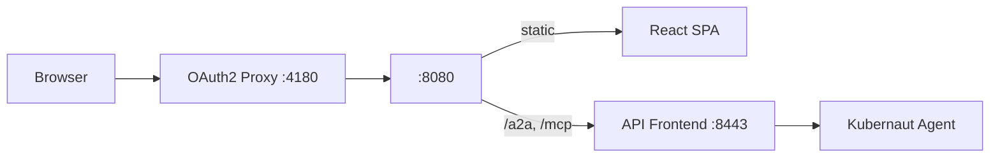

# Kubernaut Demo Console

[](https://github.com/jordigilh/kubernaut-demo-console/actions/workflows/ci.yaml)
[](LICENSE)

Real-time operator console for the [Kubernaut](https://github.com/jordigilh/kubernaut) autonomous remediation platform. Provides a chat-based interface for observing, approving, and guiding automated incident response in Kubernetes clusters.

## Features

- **A2A Streaming** — Real-time Server-Sent Events from the Kubernaut Agent
- **Thinking Panel** — Live agent reasoning visualization with collapsible sections
- **RCA Cards** — Structured root cause analysis with causal chain display
- **Workflow Selection** — Recommended remediation workflows with countdown confirmation
- **Approval Gate** — Approve/decline remediation requests before execution
- **Verification Timer** — Live activity log during stabilization window
- **Escalation** — Inline escalation input with reason capture
- **OAuth2 Authentication** — OIDC via OAuth2 Proxy sidecar (Keycloak)
- **Accessibility** — ARIA attributes, focus management, reduced-motion support

## Architecture



See [docs/architecture.md](docs/architecture.md) for detailed component and data flow diagrams.

## Quick Start

### Prerequisites

- Node.js 22+
- npm

### Local Development

```bash
# Install dependencies
npm ci

# Set up git hooks (secret scanning)
./scripts/setup-githooks.sh

# Run with mock backend (no external dependencies)
VITE_MOCK_A2A=true npm run dev

# Run with real backend
cp .env.example .env    # Configure VITE_API_BASE_URL
npm run dev             # Starts at http://localhost:5173
```

### Environment Variables

| Variable | Default | Description |
|----------|---------|-------------|
| `VITE_API_BASE_URL` | `http://localhost:8443` | Backend API Frontend URL |
| `VITE_MOCK_A2A` | `false` | Enable mock mode (no backend) |

## Testing

```bash
npm test              # Run all tests (single run)
npm run test:watch    # Watch mode
npx vitest run --coverage  # With coverage report
```

228 tests across 20 test files (Vitest + Testing Library).

## Deployment

### Helm (Recommended)

```bash
# Create OIDC secret
kubectl create secret generic kubernaut-console-oidc \
  --from-literal=client-id=kubernaut-console \
  --from-literal=client-secret=<secret> \
  --from-literal=cookie-secret=$(openssl rand -base64 32) \
  -n kubernaut-system

# Install
helm install kubernaut-console ./chart \
  --namespace kubernaut-system \
  --set auth.issuerUrl=https://keycloak.example.com/realms/your-realm

# Upgrade
helm upgrade kubernaut-console ./chart \
  --set image.tag=<commit-sha> --set image.digest="" \
  --reuse-values --wait
```

See [docs/deployment.md](docs/deployment.md) for full deployment guide and [chart/README.md](chart/README.md) for Helm values reference.

### Kind (Local Demo)

```bash
make docker-build
make kind-load
make deploy
# Access at http://localhost:4180
```

## Project Structure

```
src/
├── components/          # React UI components
│   ├── AgentBubble.tsx
│   ├── ApprovalCard.tsx
│   ├── ChatContainer.tsx
│   ├── InvestigationContext.tsx
│   ├── RCACard.tsx
│   ├── VerificationTimer.tsx
│   └── WorkflowCards.tsx
├── hooks/
│   ├── useChat.ts       # Chat state + SSE event processing
│   └── useUser.ts       # OIDC user identity
├── lib/
│   ├── a2a-client.ts    # A2A SSE streaming client
│   ├── a2a-types.ts     # Protocol type definitions
│   ├── mcp-client.ts    # MCP JSON-RPC client
│   └── audit.ts         # Session audit events
├── index.css            # Tailwind + custom theme
└── main.tsx             # Entry point
chart/                   # Helm chart
deploy/                  # Raw K8s manifests (Kind)
docs/                    # Documentation
scripts/                 # Setup and demo scripts
```

## Tech Stack

- **React 19** + TypeScript
- **Vite** — Build tooling and dev server
- **Tailwind CSS** — Utility-first styling
- **Vitest** + Testing Library — Unit and integration tests
- **OAuth2 Proxy** — OIDC authentication sidecar
- **Nginx (UBI9)** — Static serving and reverse proxy
- **Helm 3** — Kubernetes deployment

## Documentation

| Document | Description |
|----------|-------------|
| [Architecture](docs/architecture.md) | System design, data flows, component diagrams |
| [Deployment](docs/deployment.md) | Helm install, configuration, troubleshooting |
| [Development](docs/development.md) | Local setup, testing, CI/CD |
| [API Reference](docs/api.md) | A2A events, MCP tools, proxy routes |
| [ADRs](docs/adr/) | Architecture Decision Records |
| [Contributing](CONTRIBUTING.md) | How to contribute |
| [Security](SECURITY.md) | Vulnerability reporting |
| [Changelog](CHANGELOG.md) | Release history |

## Contributing

See [CONTRIBUTING.md](CONTRIBUTING.md) for development setup, coding standards, and PR process.

## License

[Apache License 2.0](LICENSE)
