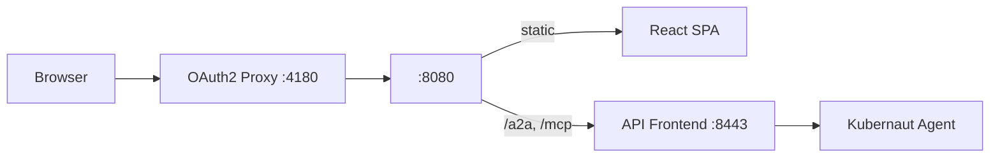

# Kubernaut Demo Console

[](https://github.com/jordigilh/kubernaut-demo-console/actions/workflows/ci.yml)
[](LICENSE)

Real-time operator console for the [Kubernaut](https://github.com/jordigilh/kubernaut) autonomous remediation platform. Provides a chat-based interface for observing, approving, and guiding automated incident response in Kubernetes clusters.

## Features

- **A2A Streaming** — Real-time Server-Sent Events from the Kubernaut Agent
- **Thinking Panel** — Live agent reasoning visualization with collapsible sections
- **RCA Cards** — Structured root cause analysis with causal chain display
- **Workflow Selection** — Recommended remediation workflows with countdown confirmation
- **Approval Gate** — Approve/decline remediation requests before execution
- **Verification Timer** — Live activity log during stabilization window
- **Phase Indicator** — Real-time remediation lifecycle tracking with elapsed timer
- **Escalation** — Inline escalation input with reason capture
- **Multi-Platform** — Standalone, OCP Console Plugin, and Backstage plugin targets
- **OAuth2 Authentication** — OIDC via OAuth2 Proxy sidecar (Keycloak)
- **Accessibility** — ARIA attributes, focus management, reduced-motion support

## Architecture



See [docs/architecture.md](docs/architecture.md) for detailed component and data flow diagrams.

## Quick Start

### Prerequisites

- Node.js 22+
- pnpm 11+ (`corepack enable && corepack prepare pnpm@11.7.0 --activate`)

### Local Development

```bash
# Install dependencies
pnpm install

# Set up git hooks (secret scanning)
./scripts/setup-githooks.sh

# Run with mock backend (no external dependencies)
VITE_MOCK_A2A=true pnpm dev

# Run with real backend
cp .env.example .env    # Configure VITE_API_UPSTREAM
pnpm dev                # Starts at http://localhost:5173
```

### Environment Variables

| Variable | Default | Description |
|----------|---------|-------------|
| `VITE_API_UPSTREAM` | `http://localhost:8443` | Backend API Frontend URL |
| `VITE_MOCK_A2A` | `false` | Enable mock mode (no backend) |

## Testing

```bash
pnpm test             # Run all tests (single run via Turborepo)
pnpm --filter @kubernaut/ui-core test -- --watch  # Watch mode for ui-core
```

352 tests across 35 test files (Vitest + Testing Library).

## Deployment

### Helm (Recommended)

```bash
# Create OIDC secret
kubectl create secret generic kubernaut-console-oidc \
  --from-literal=client-id=kubernaut-console \
  --from-literal=client-secret=<secret> \
  --from-literal=cookie-secret=$(openssl rand -base64 32) \
  -n kubernaut-system

# Install
helm install kubernaut-console ./chart \
  --namespace kubernaut-system \
  --set auth.issuerUrl=https://keycloak.example.com/realms/your-realm

# Upgrade
helm upgrade kubernaut-console ./chart \
  --set image.tag=<commit-sha> --set image.digest="" \
  --reuse-values --wait
```

See [docs/deployment.md](docs/deployment.md) for full deployment guide and [chart/README.md](chart/README.md) for Helm values reference.

### Kind (Local Demo)

```bash
make docker-build
make kind-load
make deploy
# Access at http://localhost:4180
```

## Project Structure

```
packages/
├── ui-core/             # Shared UI library (@kubernaut/ui-core)
│   ├── src/components/  # React components (ChatContainer, AgentBubble, etc.)
│   ├── src/hooks/       # useChat, useRRStatus, useUser
│   ├── src/lib/         # A2A/MCP clients, SSE reader, session state
│   └── src/providers/   # Auth and config context providers
├── standalone/          # Standalone Vite application (nginx + oauth2-proxy)
├── plugin-backstage/    # Backstage frontend plugin (Module Federation)
└── plugin-ocm/          # OCP console dynamic plugin (Webpack Federation)
e2e/                     # Playwright E2E tests (a11y, visual, integration)
chart/                   # Helm chart
docs/                    # Documentation
scripts/                 # Build and CI utilities
```

## Tech Stack

- **React 19** + TypeScript
- **PatternFly 6** — Component library and chat UI
- **Vite** — Build tooling and dev server (ui-core, standalone)
- **Webpack** — OCP console plugin build
- **Turborepo** — Monorepo task orchestration
- **Vitest** + Testing Library — Unit and integration tests
- **Playwright** — E2E and visual regression testing
- **OAuth2 Proxy** — OIDC authentication sidecar
- **Nginx (UBI9)** — Static serving and reverse proxy
- **Helm 3** — Kubernetes deployment

## Documentation

| Document | Description |
|----------|-------------|
| [Architecture](docs/architecture.md) | System design, data flows, component diagrams |
| [Deployment](docs/deployment.md) | Helm install, configuration, troubleshooting |
| [Development](docs/development.md) | Local setup, testing, CI/CD |
| [Migration Design](docs/migration/design.md) | Multi-platform architecture decisions |
| [Backstage Install](docs/migration/backstage-install.md) | RHDH/Backstage plugin deployment |
| [ACM Adaptation](docs/migration/acm-adaptation.md) | OCM/ACM plugin configuration |
| [Contributing](CONTRIBUTING.md) | How to contribute |
| [Security](SECURITY.md) | Vulnerability reporting |
| [Changelog](CHANGELOG.md) | Release history |

## Contributing

See [CONTRIBUTING.md](CONTRIBUTING.md) for development setup, coding standards, and PR process.

## License

[Apache License 2.0](LICENSE)
