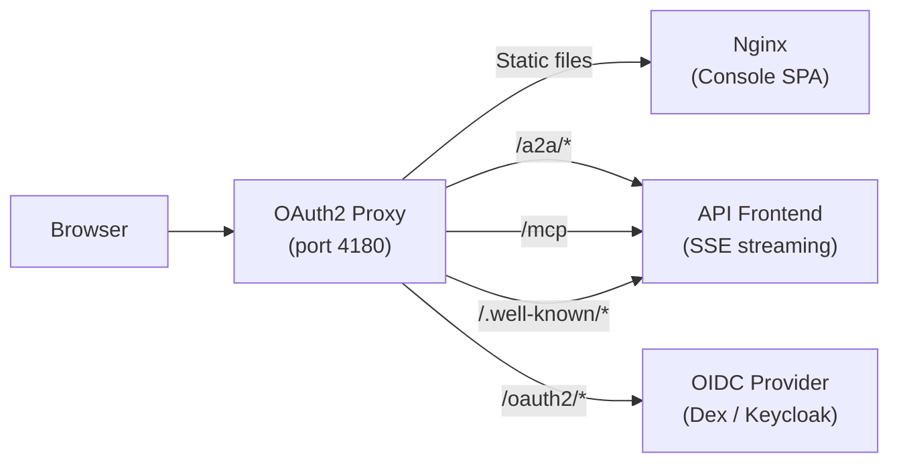

# Kubernaut Console

A production-ready web console for [Kubernaut](https://github.com/jordigilh/kubernaut)'s A2A (Agent-to-Agent) incident remediation platform. This React SPA connects to Kubernaut's API Frontend over the A2A protocol and provides a chat-based interface for interactive Kubernetes incident investigation and remediation.

## Features

- **A2A SSE streaming** — Real-time agent communication via `fetch()` + `ReadableStream` (JSON-RPC `message/stream`)
- **Investigation banner** — Live status display with RR ID, namespace, resource, alert name, and phase
- **Thinking panel** — Collapsible frame showing agent reasoning, tool calls, and investigation events
- **Workflow cards** — Structured decision rendering with risk assessment and RECOMMENDED badge
- **Root cause analysis** — Interactive RCA card with causal chain, confidence, and tool call metrics
- **Human-in-the-loop approval** — Remediation approval cards with approve/decline actions via MCP
- **Verification timer** — Real-time stabilization countdown with server-synchronized timestamps
- **Markdown rendering** — Full GFM support with XSS sanitization (rehype-sanitize)
- **OAuth2 Proxy auth** — OIDC authentication via Dex/Keycloak, no client-side auth code needed
- **FedRAMP audit events** — Client-side telemetry for approve, decline, escalate, dismiss, execute, and session clear actions

## Architecture



See [docs/architecture.md](docs/architecture.md) for detailed data flow and component interactions.

## Quick Start

### Local Development

```bash
# Install dependencies
npm install

# Start dev server (proxies /a2a, /mcp, /.well-known to localhost:8443)
npm run dev

# Run tests
npm test

# Lint
npm run lint
```

The Vite dev server proxies API requests to `localhost:8443` (API Frontend). Use `kubectl port-forward` to expose AF locally:

```bash
kubectl port-forward -n kubernaut-system svc/apifrontend-service 8443:8443
```

For frontend-only development without a backend, enable mock mode:

```bash
VITE_MOCK_A2A=true npm run dev
```

### Kind Demo Deployment

See [docs/deployment.md](docs/deployment.md) for complete deployment instructions covering:
- Kind cluster setup with Kubernaut
- Helm chart deployment (production/OpenShift)
- OIDC configuration
- Nginx security hardening

## Project Structure

```
src/
  components/       UI components (19 total)
    ChatContainer.tsx       Main chat frame and state orchestration
    AgentBubble.tsx         Agent message rendering + embedded cards
    WorkflowCards.tsx       Decision cards with risk/recommendation
    ApprovalCard.tsx        Human-in-the-loop approval UI
    RCACard.tsx             Root cause analysis display
    InvestigationContext.tsx Investigation status banner
    VerificationTimer.tsx   Stabilization countdown
    ThinkingPanel.tsx       Collapsible reasoning panel
    WelcomeState.tsx        Empty state with suggestion chips
    MarkdownContent.tsx     Sanitized GFM renderer
  hooks/
    useChat.ts              Core A2A streaming state machine
    useUser.ts              User identity from OAuth2 headers
  lib/
    a2a-client.ts           SSE/JSON-RPC streaming client
    a2a-types.ts            A2A protocol TypeScript types
    a2a-mock.ts             Mock stream for frontend-only dev
    mcp-client.ts           MCP tool invocation (JSON-RPC)
    audit.ts                Client-side audit telemetry
    schemas/                Typed payload schemas
deploy/
  nginx.conf                Production nginx config (baked into image)
  kind/                     Kind demo manifests (oauth2-proxy, nginx, dex)
chart/
  Chart.yaml                Helm chart for production/OpenShift
  values.yaml               Configurable deployment values
```

## Tech Stack

- [Vite](https://vite.dev) v8 + [React](https://react.dev) 19 + TypeScript 6
- [Tailwind CSS](https://tailwindcss.com) v4
- [react-markdown](https://github.com/remarkjs/react-markdown) + remark-gfm + rehype-sanitize
- [Vitest](https://vitest.dev) + Testing Library for unit/integration tests
- [OAuth2 Proxy](https://oauth2-proxy.github.io/oauth2-proxy/) for authentication
- UBI9 (Red Hat Universal Base Image) for container runtime

## Documentation

| Document | Description |
|----------|-------------|
| [Architecture](docs/architecture.md) | System design, data flow, component interactions |
| [Deployment](docs/deployment.md) | Helm, Kind, OIDC setup, nginx configuration |
| [Development](docs/development.md) | Local setup, mock mode, testing strategy |
| [Integration Guide](docs/integration-guide.md) | A2A/MCP protocol reference for backend teams |
| [Security](SECURITY.md) | Vulnerability reporting and FedRAMP controls |
| [Contributing](CONTRIBUTING.md) | PR process, coding standards, test requirements |
| [Changelog](CHANGELOG.md) | Release history |
| [ADRs](docs/adr/) | Architecture decision records |

## License

Apache License 2.0. See [LICENSE](LICENSE).
