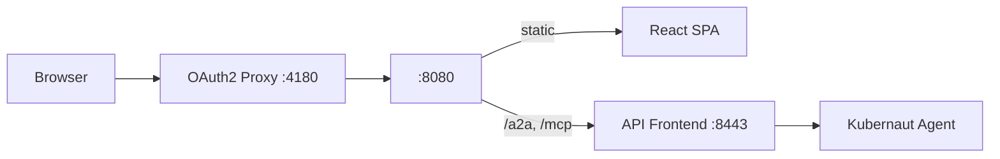

# Kubernaut Console

[](https://github.com/jordigilh/kubernaut-demo-console/actions/workflows/ci.yml)
[](LICENSE)

Real-time operator console for the [Kubernaut](https://github.com/jordigilh/kubernaut) autonomous remediation platform. Provides a chat-based interface for observing, approving, and guiding automated incident response in Kubernetes clusters.

## Features

- **A2A Streaming** — Real-time Server-Sent Events from the Kubernaut Agent
- **Thinking Panel** — Live agent reasoning visualization with collapsible sections
- **RCA Cards** — Structured root cause analysis with causal chain display
- **Workflow Selection** — Recommended remediation workflows with countdown confirmation
- **Approval Gate** — Approve/decline remediation requests before execution
- **Verification Timer** — Live activity log during stabilization window
- **Phase Indicator** — Real-time remediation lifecycle tracking with elapsed timer
- **Escalation** — Inline escalation input with reason capture
- **OAuth2 Authentication** — OIDC via OAuth2 Proxy sidecar (Keycloak)
- **Accessibility** — ARIA attributes, focus management, reduced-motion support

## Architecture


```mermaid
graph LR
    Browser --> OAuth["OAuth2 Proxy :4180"]
    OAuth --> Nginx[":8080"]
    Nginx -->|"static"| SPA["React SPA"]
    Nginx -->|"/a2a, /mcp"| AF["API Frontend :8443"]
    AF --> KA["Kubernaut Agent"]
```

See [docs/architecture.md](docs/architecture.md) for detailed component and data flow diagrams.

## Quick Start

### Prerequisites

- Node.js 22+
- pnpm 11+ (`corepack enable && corepack prepare pnpm@11.7.0 --activate`)

### Local Development

```bash
# Install dependencies
pnpm install

# Set up git hooks (secret scanning)
./scripts/setup-githooks.sh

# Run with mock backend (no external dependencies)
VITE_MOCK_A2A=true pnpm dev

# Run with real backend
cp .env.example .env    # Configure VITE_API_UPSTREAM
pnpm dev                # Starts at http://localhost:5173
```

### Environment Variables

| Variable | Default | Description |
|----------|---------|-------------|
| `VITE_API_UPSTREAM` | `http://localhost:8443` | Backend API Frontend URL |
| `VITE_MOCK_A2A` | `false` | Enable mock mode (no backend) |

## Testing

```bash
pnpm test             # Run all tests (single run via Turborepo)
pnpm --filter @kubernaut/ui-core test -- --watch  # Watch mode for ui-core
```

352 tests across 35 test files (Vitest + Testing Library).

## Compatibility

Starting with `v1.1.0`, kubernaut-console is versioned **independently** of
[kubernaut](https://github.com/jordigilh/kubernaut) and
[kubernaut-operator](https://github.com/jordigilh/kubernaut-operator) — its
version number is no longer kept 1:1 with the upstream release it ships
alongside. A console version stays valid for every upstream line it's
actually compatible with; a new console version is only cut when a
console-side change forces one (e.g. a fix that must not apply to an older
supported line), not on every upstream version bump.

| kubernaut-console | Compatible kubernaut / kubernaut-operator |
|---|---|
| `v1.1.x` | `v1.5.x`, `v1.6.x` |
| `v1.5.7`, `v1.5.6`, `v1.5.0-rc1`–`v1.5.6-rc4` | Same version (1:1 aligned — legacy scheme) |
| `v1.0.0` | `v1.0.0` |

If a fix is ever needed for only one upstream line going forward, it will be
released from a dedicated `release/vX.Y` branch (see
[`release/v1.5`](https://github.com/jordigilh/kubernaut-console/tree/release/v1.5))
instead of forcing a version bump on lines that don't need the change.

## Deployment

This repo does not ship its own Helm chart — the console is deployed as part
of the Kubernaut platform, either via
[kubernaut-operator](https://github.com/jordigilh/kubernaut-operator) (set
`spec.console.enabled: true` on the `Kubernaut` CR — recommended) or
[kubernaut](https://github.com/jordigilh/kubernaut)'s own Helm chart (set
`console.enabled: true`). Both use this repo's published
`quay.io/kubernaut-ai/kubernaut-console` image.

See [docs/deployment.md](docs/deployment.md) for the full deployment guide.

### Kind (Local Demo)

```bash
make docker-build
make kind-load
make deploy
# Access at http://localhost:4180
```

## Project Structure

```
packages/
├── ui-core/             # Shared UI library (@kubernaut/ui-core)
│   ├── src/components/  # React components (ChatContainer, AgentBubble, etc.)
│   ├── src/hooks/       # useChat, useRRStatus, useUser
│   ├── src/lib/         # A2A/MCP clients, SSE reader, session state
│   └── src/providers/   # Auth and config context providers
└── standalone/          # Standalone Vite application (nginx + oauth2-proxy)
e2e/                     # Playwright E2E tests (a11y, visual, integration)
docs/                    # Documentation
scripts/                 # Build and CI utilities
```

> **Note**: this repo previously scaffolded `plugin-backstage` and `plugin-ocm`
> packages for a multi-platform (Backstage/OCM) plugin architecture. That work
> is currently deferred — see [ADR-007](docs/adr/007-multi-platform-plugin-architecture.md)
> — and only the standalone console is actively maintained.

## Tech Stack

- **React 19** + TypeScript
- **PatternFly 6** — Component library and chat UI
- **Vite** — Build tooling and dev server (ui-core, standalone)
- **Turborepo** — Monorepo task orchestration
- **Vitest** + Testing Library — Unit and integration tests
- **Playwright** — E2E and visual regression testing
- **OAuth2 Proxy** — OIDC authentication sidecar
- **Nginx (UBI9)** — Static serving and reverse proxy
- **Helm 3** — Kubernetes deployment

## Documentation

| Document | Description |
|----------|-------------|
| [Architecture](docs/architecture.md) | System design, data flows, component diagrams |
| [Deployment](docs/deployment.md) | Helm install, configuration, troubleshooting |
| [Development](docs/development.md) | Local setup, testing, CI/CD |
| [Migration Design](docs/migration/design.md) | Multi-platform architecture decisions (deferred, see ADR-007) |
| [Contributing](CONTRIBUTING.md) | How to contribute |
| [Security](SECURITY.md) | Vulnerability reporting |
| [Changelog](CHANGELOG.md) | Release history |

## Contributing

See [CONTRIBUTING.md](CONTRIBUTING.md) for development setup, coding standards, and PR process.

## License

[Apache License 2.0](LICENSE)
