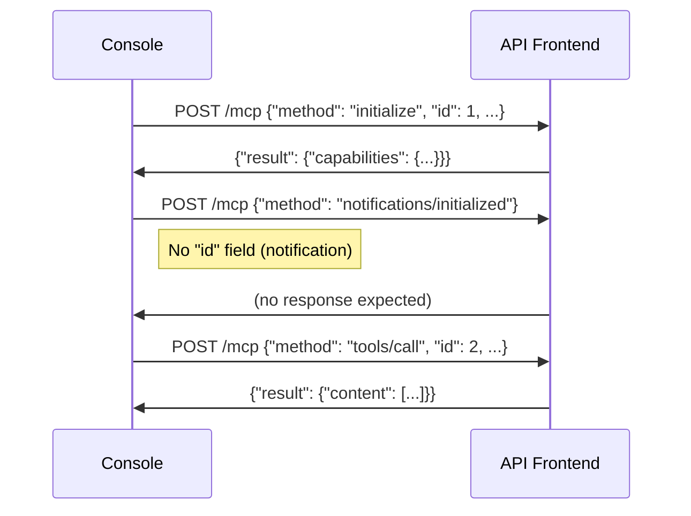

# API Reference

The Kubernaut Demo Console communicates with the API Frontend (AF) over two protocols:
- **A2A (Agent-to-Agent)** — SSE streaming for chat interaction
- **MCP (Model Context Protocol)** — JSON-RPC for deterministic tool calls

Both are proxied through the console's Nginx container.

## Proxy Routes

| Path | Target | Protocol | Timeout |
|------|--------|----------|---------|
| `/a2a/*` | `apiFrontend.url` | SSE (Server-Sent Events) | 5 minutes |
| `/mcp` | `apiFrontend.url` | JSON-RPC 2.0 over HTTP | 30 seconds |
| `/.well-known/*` | `apiFrontend.url` | HTTP GET (agent card) | 10 seconds |

All proxied requests include `Authorization: Bearer <token>` extracted from the `X-Forwarded-Access-Token` header set by oauth2-proxy.

## A2A Protocol

### Sending Messages

```
POST /a2a/{task-id}
Content-Type: application/json

{
  "jsonrpc": "2.0",
  "id": "req-1",
  "method": "message/stream",
  "params": {
    "message": {
      "role": "user",
      "parts": [{ "kind": "text", "text": "investigate this alert" }]
    }
  }
}
```

Response: SSE stream of events.

### Event Types

#### Status Update Events

```typescript
interface StatusUpdateEvent {
  kind: "status-update";
  taskId: string;
  contextId: string;
  status: TaskStatus;
  metadata?: {
    type?: "reasoning" | "status" | "investigation" | "decision"
         | "output" | "preflight" | "tool_call" | "verification_step"
         | "approval_request" | "approval_request_resolved"
         | "problem_resolved" | "alignment_check_failed" | "keepalive";
    // Additional fields depend on type
  };
}
```

#### Artifact Update Events

```typescript
interface ArtifactUpdateEvent {
  kind: "artifact-update";
  taskId: string;
  contextId: string;
  artifact: {
    artifactId: string;
    parts: Part[];
    metadata?: {
      type?: "execution_progress" | "rca" | "workflow_options";
    };
  };
  lastChunk: boolean;
  append?: boolean;
}
```

### Metadata Types

#### `type=verification_step`

Emitted during the Verifying phase for each verification check:

```json
{
  "type": "verification_step",
  "step": "alert_check",
  "step_status": "in_progress",
  "detail": "Waiting for KubePodCrashLooping to clear",
  "elapsed_s": 45,
  "retry_count": 2
}
```

| Field | Type | Description |
|-------|------|-------------|
| `step` | `stabilization_elapsed \| spec_hash_computed \| alert_check \| health_check` | Step identifier |
| `step_status` | `in_progress \| completed \| failed` | Current step status |
| `detail` | string (optional) | Human-readable description |
| `elapsed_s` | integer (optional) | Seconds since verification started |
| `retry_count` | integer (optional) | Number of retries for this step |

#### `type=execution_progress` (Artifact)

Phase-level timer data during execution/verification:

```json
{
  "current_phase": "Verifying",
  "rr_name": "rr-abc123",
  "started_at": "2026-06-15T22:58:09Z",
  "stabilization_window": "120s"
}
```

## MCP Protocol

### Session Lifecycle

The MCP endpoint requires initialization before tool calls:



Key: `notifications/initialized` is a JSON-RPC **notification** (no `id` field). Including an `id` causes the server to reject subsequent `tools/call` requests.

### Available Tools

#### `kubernaut_approve`

Approve or decline a Remediation Approval Request.

```json
{
  "method": "tools/call",
  "params": {
    "name": "kubernaut_approve",
    "arguments": {
      "rar_name": "rar-abc123",
      "decision": "Approved",
      "reason": "Reviewed and approved by operator"
    }
  }
}
```

#### `kubernaut_select_workflow`

Select a remediation workflow for execution.

```json
{
  "method": "tools/call",
  "params": {
    "name": "kubernaut_select_workflow",
    "arguments": {
      "rr_id": "rr-abc123",
      "workflow_id": "48dec870-cb96-5dd2-a29c-f518735ab23d"
    }
  }
}
```

#### `kubernaut_complete_no_action`

Dismiss or escalate an investigation.

```json
{
  "method": "tools/call",
  "params": {
    "name": "kubernaut_complete_no_action",
    "arguments": {
      "rr_id": "rr-abc123",
      "reason": "Dismissed by operator: no action needed"
    }
  }
}
```

For escalation, include `escalation_reason`:
```json
{
  "arguments": {
    "rr_id": "rr-abc123",
    "reason": "Escalated by operator",
    "escalation_reason": "Requires manual database migration"
  }
}
```

### Response Format

MCP responses may be wrapped in SSE format:

```
event: message
data: {"jsonrpc":"2.0","id":3,"result":{"content":[{"type":"text","text":"done"}]}}
```

The console parses both plain JSON and SSE-wrapped responses.

## Agent Discovery

```
GET /.well-known/agent.json
```

Returns the A2A agent card with supported methods and capabilities.
