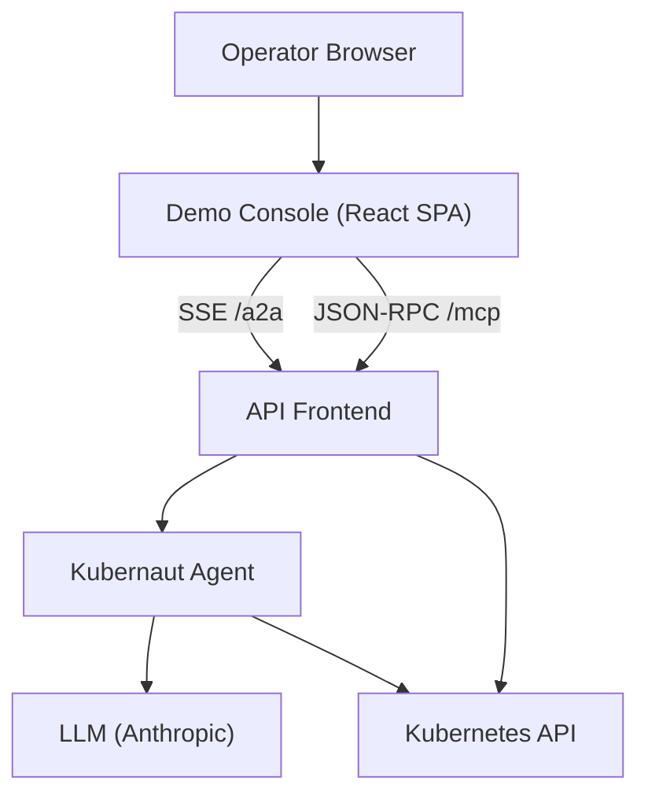
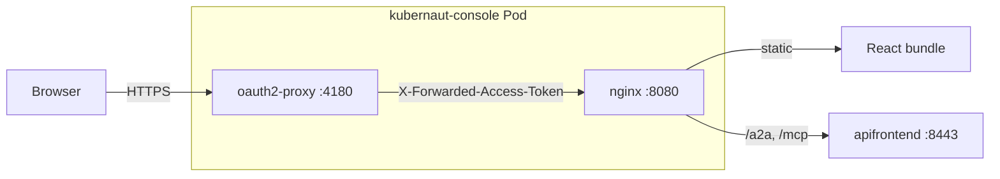
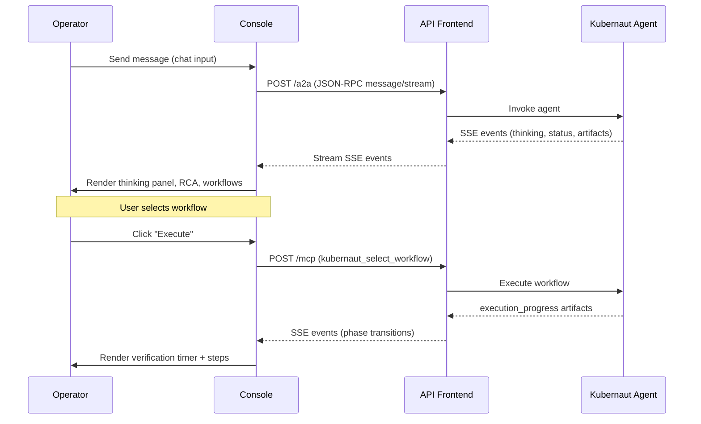
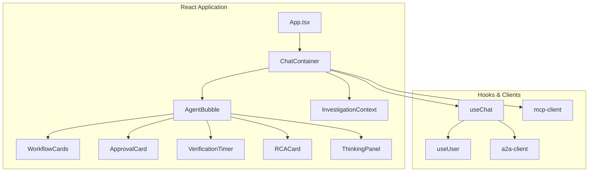
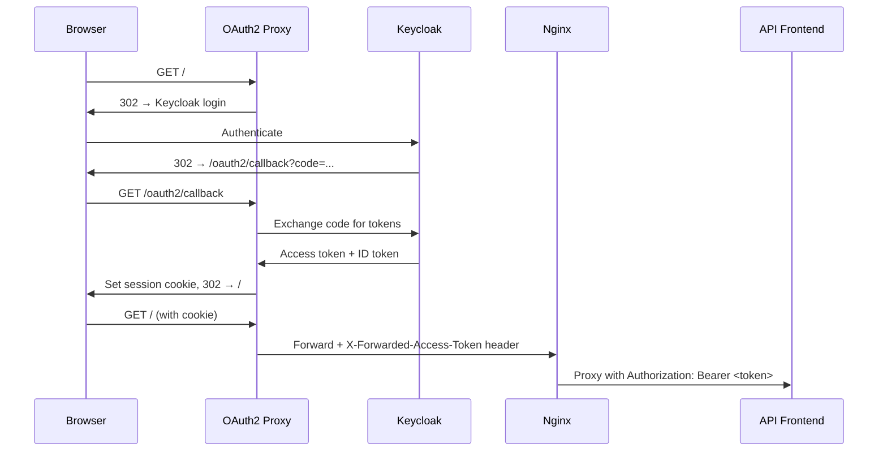

# Architecture

## System Context

The Kubernaut Demo Console is the user-facing web application for the Kubernaut autonomous remediation platform. It provides a real-time chat interface for operators to observe, approve, and guide automated incident response.

## Container Architecture

Each console pod runs two containers in a sidecar pattern:

| Container | Role | Port |
|-----------|------|------|
| oauth2-proxy | OIDC authentication gateway | 4180 (service-facing) |
| console (nginx) | Static file server + reverse proxy | 8080 (internal) |

## Data Flow

### Investigation Lifecycle

### Event Types

| A2A Event | Console Handling |
|-----------|-----------------|
| `status-update` (type=reasoning) | ThinkingPanel — agent reasoning stream |
| `status-update` (type=status) | Phase transitions, banner updates |
| `status-update` (type=verification_step) | VerificationTimer activity log |
| `artifact-update` (type=execution_progress) | Timer data (stabilization_window, started_at) |
| `artifact-update` (type=rca) | RCACard — root cause analysis display |
| `artifact-update` (type=workflow_options) | WorkflowCards — remediation options |

### MCP Tool Calls (Console → Backend)

| Tool | Purpose | Trigger |
|------|---------|---------|
| `kubernaut_approve` | Approve remediation approval request | ApprovalCard "Approve" |
| `kubernaut_select_workflow` | Select workflow for execution | WorkflowCard "Execute" |
| `kubernaut_complete_no_action` | Dismiss or escalate investigation | "No action needed" / "Escalate" |

## Component Architecture

## Authentication Flow

## Key Design Decisions

See [ADRs](adr/) for detailed rationale. Summary:

1. **OAuth2 Proxy sidecar** over client-side OIDC — keeps secrets out of the browser
2. **SSE via fetch + ReadableStream** over EventSource — supports POST with body, custom headers
3. **MCP direct calls** for deterministic actions — avoids LLM round-trip for approve/dismiss/select
4. **Dual-container pod** — separation of concerns (auth vs serving), independent scaling
5. **Mock A2A mode** — enables frontend development without backend dependencies
