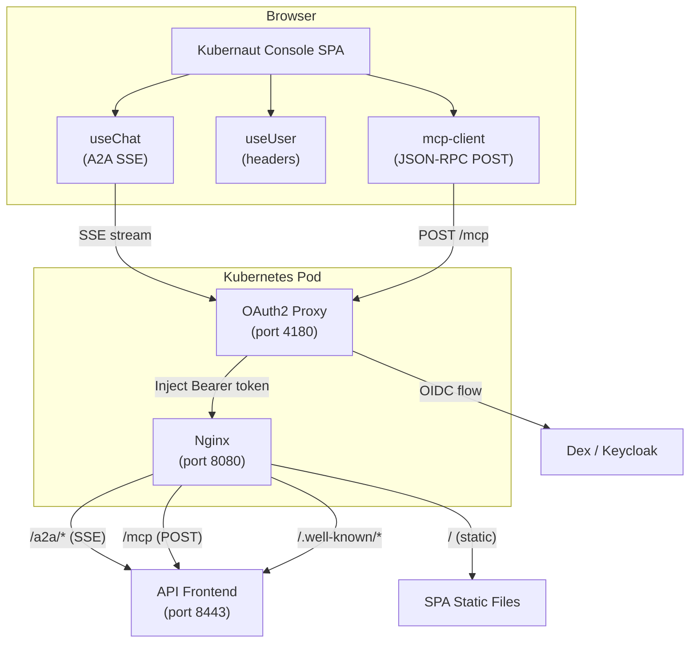
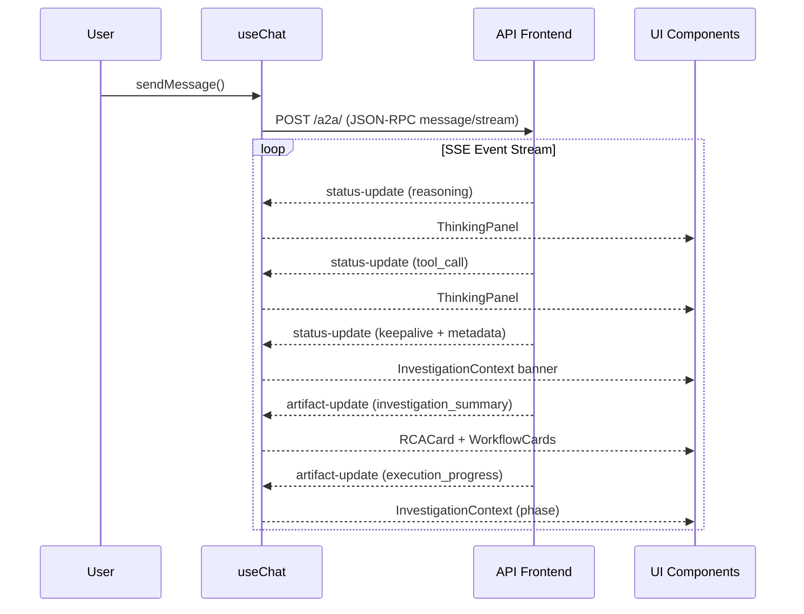
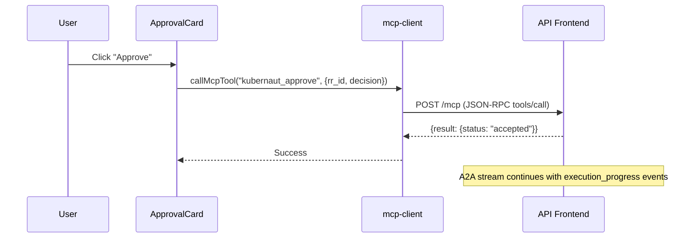
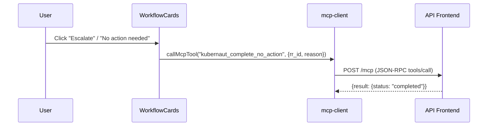
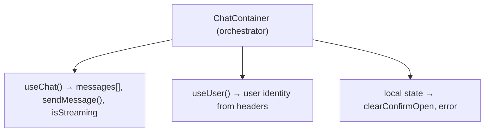
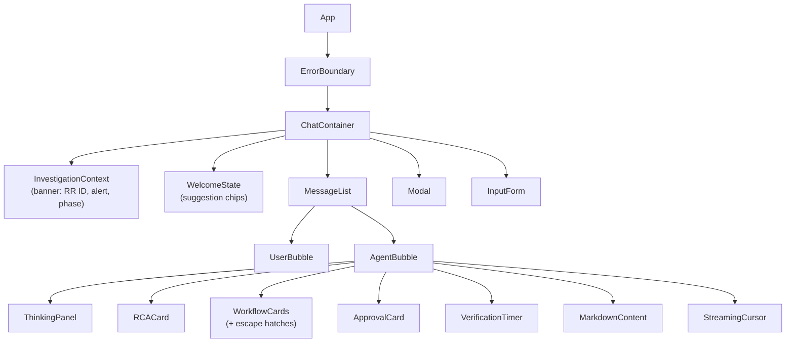
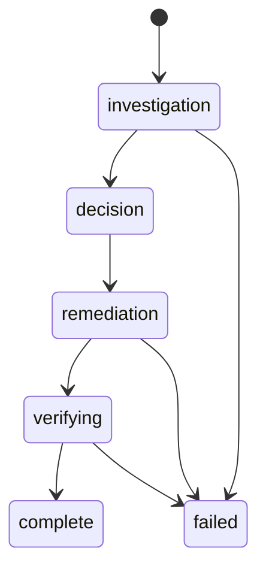
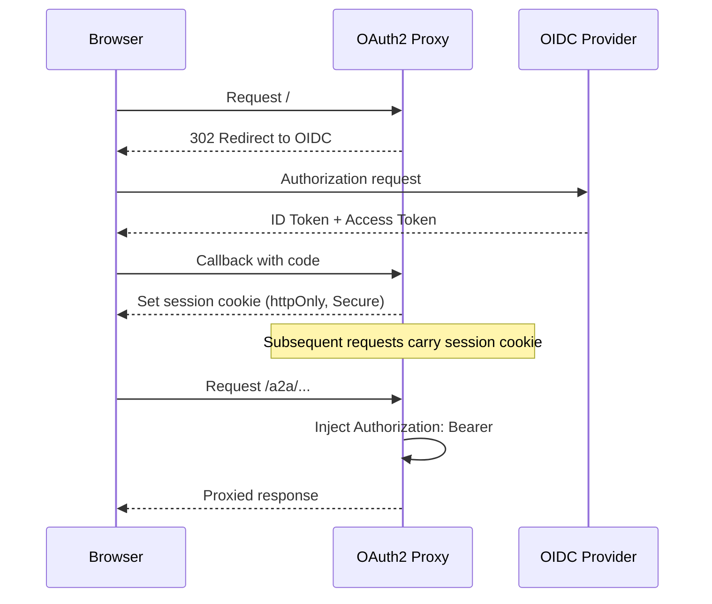
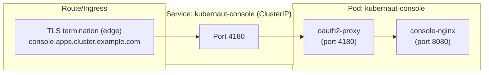
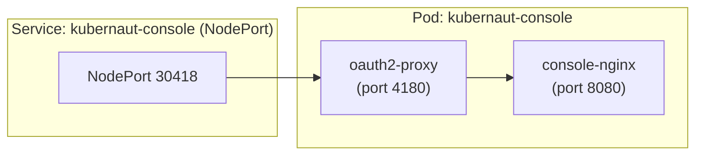

# Architecture

This document describes the system architecture, data flow, and component interactions of Kubernaut Console.

## System Overview

Kubernaut Console is a React Single Page Application (SPA) that communicates with Kubernaut's API Frontend (AF) using two protocols:

1. **A2A (Agent-to-Agent)** — JSON-RPC over Server-Sent Events for real-time agent communication
2. **MCP (Model Context Protocol)** — JSON-RPC over HTTP POST for discrete tool invocations



## Data Flow

### 1. Investigation Flow (A2A)



### 2. Approval Flow (MCP)



### 3. Escalation/Dismiss Flow (MCP)



## Component Architecture

### State Management

The application uses React hooks for state management — no external state library.



### Component Hierarchy



### Message Lifecycle

Each `ChatMessage` progresses through phases:



Phase transitions are driven by:
- **Status event metadata** (`phase` field from AF)
- **Artifact types** (`investigation_summary` → decision, `execution_progress` → remediation/verifying)
- **Text pattern matching** (legacy fallback for unstructured AF responses)

## Protocol Details

### A2A (Agent-to-Agent)

- **Transport**: HTTP POST with SSE response body
- **Encoding**: JSON-RPC 2.0 (`message/stream` method)
- **Events**: `status-update` and `artifact-update` (see [Integration Guide](integration-guide.md))
- **Connection**: Single long-lived request per conversation turn
- **Reconnection**: Automatic retry on network failure (with backoff)

### MCP (Model Context Protocol)

- **Transport**: HTTP POST / JSON response
- **Encoding**: JSON-RPC 2.0 (`tools/call` method)
- **Endpoint**: `/mcp`
- **Tools**: `kubernaut_approve`, `kubernaut_complete_no_action`
- **Authentication**: Bearer token injected by OAuth2 Proxy

### Status Event Metadata

Every status event after RR creation carries:

```json
{
  "metadata": {
    "type": "reasoning|tool_call|keepalive|...",
    "rr_id": "rr-47ec5289",
    "namespace": "production",
    "kind": "Deployment",
    "target": "api-frontend",
    "alert_name": "HighLatency",
    "phase": "Investigating"
  }
}
```

## Security Architecture

### Authentication



- No client-side token handling
- OAuth2 Proxy extracts user info into `X-Auth-Request-*` headers
- `useUser` hook reads identity from response headers

### Authorization

- All API calls authenticated via Bearer token (injected by proxy)
- MCP tools respect Kubernetes RBAC on the backend
- Console has no direct cluster access

### Data Protection

- No sensitive data stored in browser (sessionStorage for chat history only)
- Audit events fire-and-forget via `sendBeacon` (no response needed)
- CSP prevents data exfiltration via inline scripts or unauthorized domains

## Deployment Topology

See [Deployment Guide](deployment.md) for configuration details.

### Production (Helm)



### Kind (Demo)


