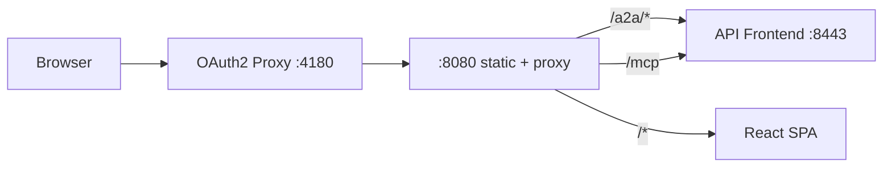

# Deployment Guide

This guide covers deploying the Kubernaut Demo Console to Kubernetes environments.

## Prerequisites

- Kubernetes cluster (Kind for local, OpenShift for production)
- Helm 3.x
- kubectl configured for your cluster
- OIDC provider (Keycloak) with a client configured for the console
- Kubernaut API Frontend (apifrontend) deployed in the same cluster

## Architecture Overview



The console pod contains two containers:
1. **oauth2-proxy** — Handles OIDC authentication, sets `X-Forwarded-Access-Token`
2. **console (nginx)** — Serves static React app and proxies API calls to apifrontend

## Helm Installation

### 1. Create OIDC Secret

```bash
kubectl create secret generic kubernaut-console-oidc \
  --from-literal=client-id=kubernaut-console \
  --from-literal=client-secret=<your-client-secret> \
  --from-literal=cookie-secret=$(openssl rand -base64 32) \
  -n kubernaut-system
```

### 2. Install the Chart

```bash
helm install kubernaut-console ./chart \
  --namespace kubernaut-system \
  --set auth.issuerUrl=https://keycloak.example.com/realms/your-realm \
  --set apiFrontend.url=http://apifrontend.kubernaut-system.svc:8443
```

### 3. Upgrade

```bash
helm upgrade kubernaut-console ./chart \
  --namespace kubernaut-system \
  --set image.tag=<commit-sha> \
  --set image.digest="" \
  --reuse-values \
  --wait
```

## Configuration Reference

### Helm Values

| Key | Default | Description |
|-----|---------|-------------|
| `image.repository` | `ghcr.io/jordigilh/kubernaut-demo-console` | Container image registry |
| `image.tag` | (chart default) | Image tag (short commit SHA) |
| `image.digest` | (none) | SHA256 digest — overrides tag when set |
| `image.pullPolicy` | `IfNotPresent` | Image pull policy |
| `apiFrontend.url` | `http://apifrontend.kubernaut-system.svc:8443` | Backend API Frontend URL |
| `auth.provider` | `oidc` | OAuth2 provider type |
| `auth.issuerUrl` | (required) | OIDC issuer URL |
| `auth.clientId` | `kubernaut-console` | OIDC client ID |
| `auth.skipTlsVerify` | `false` | Skip TLS verification (dev only) |
| `auth.existingSecret` | `kubernaut-console-oidc` | Secret containing OIDC credentials |
| `service.type` | `ClusterIP` | Kubernetes Service type |
| `service.port` | `4180` | Service port |
| `route.enabled` | `true` | Create OpenShift Route |
| `route.tls.termination` | `edge` | TLS termination mode |
| `resources.oauth2Proxy` | 25m/32Mi req, 100m/128Mi lim | OAuth2 Proxy resources |
| `resources.nginx` | 10m/16Mi req, 50m/64Mi lim | Nginx resources |

### Environment-Specific Overrides

**Development:**
```yaml
auth:
  skipTlsVerify: true
image:
  tag: "latest"
  pullPolicy: Always
```

**Production:**
```yaml
auth:
  skipTlsVerify: false
image:
  digest: "sha256:..."
  pullPolicy: IfNotPresent
route:
  host: console.kubernaut.example.com
```

## Local Development with Kind

```bash
# One-time setup
make docker-build
make kind-load

# Deploy
make deploy

# Access
kubectl port-forward -n kubernaut-system svc/kubernaut-console 4180:4180
open http://localhost:4180
```

Or use the demo setup script:
```bash
./scripts/demo-setup.sh
```

## Nginx Configuration

The console uses a split Nginx config baked into the container image:

- `deploy/nginx-http.conf` — HTTP-level directives (rate limiting, gzip)
- `deploy/nginx-server.conf` — Server-level directives (locations, proxy, headers)

Key proxy routes:
- `/a2a/*` → `apiFrontend.url` (SSE streaming, 5min timeouts)
- `/mcp` → `apiFrontend.url` (JSON-RPC, 30s timeout)
- `/.well-known/*` → `apiFrontend.url` (agent card discovery)
- `/*` → static files (React SPA with fallback to index.html)

## Troubleshooting

### "Your session has expired"
The OAuth2 Proxy passes the token via `X-Forwarded-Access-Token`. Ensure Nginx reads it:
```nginx
proxy_set_header Authorization "Bearer $http_x_forwarded_access_token";
```

### Pod stuck in CrashLoopBackOff
Check the nginx container logs — common causes:
- Missing `/tmp` writable directory
- Port conflict (oauth2-proxy and nginx must use different ports)

### Helm upgrade conflict
If server-side apply conflicts occur:
```bash
helm upgrade kubernaut-console ./chart --reuse-values --wait
```
Avoid `--force` as it conflicts with server-side apply.
