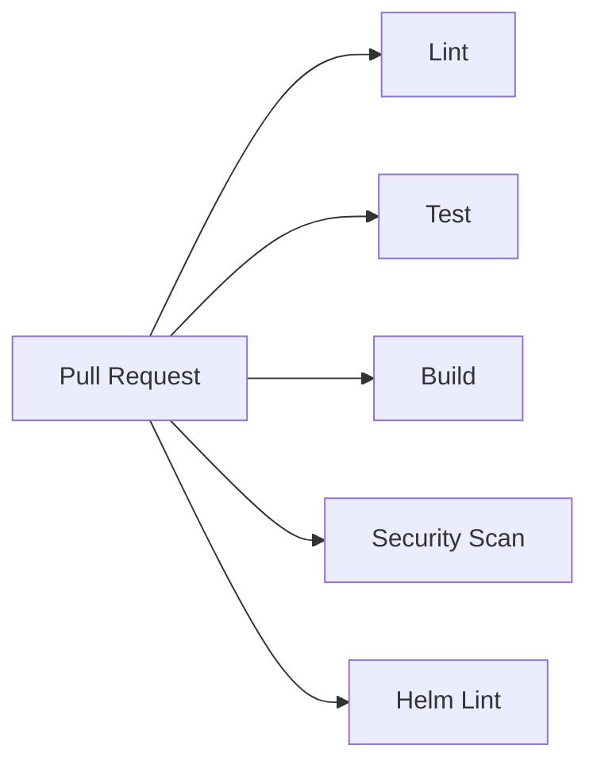

# Development Guide

## Quick Start

```bash
git clone https://github.com/jordigilh/kubernaut-demo-console.git
cd kubernaut-demo-console
npm ci
./scripts/setup-githooks.sh
npm run dev
```

The dev server starts at `http://localhost:5173` with hot reload.

## Environment Variables

Copy `.env.example` to `.env` and adjust:

| Variable | Default | Description |
|----------|---------|-------------|
| `VITE_API_BASE_URL` | `http://localhost:8443` | Backend API Frontend URL (used by Vite proxy) |
| `VITE_MOCK_A2A` | `false` | Enable mock mode (no backend needed) |

## Development Modes

### Mock Mode (Frontend Only)

```bash
VITE_MOCK_A2A=true npm run dev
```

Uses canned responses for A2A streaming. Useful for UI development without a running backend.

### Full Stack (With Backend)

```bash
# Terminal 1: port-forward to apifrontend
kubectl port-forward -n kubernaut-system svc/apifrontend 8443:8443

# Terminal 2: run dev server
npm run dev
```

The Vite dev proxy forwards `/a2a`, `/mcp`, and `/.well-known` to the backend.

## Available Commands

### npm Scripts

| Command | Description |
|---------|-------------|
| `npm run dev` | Start Vite dev server with HMR |
| `npm run build` | TypeScript check + production build |
| `npm run lint` | Run ESLint |
| `npm test` | Run Vitest (single run) |
| `npm run test:watch` | Run Vitest in watch mode |
| `npm run preview` | Serve production build locally |

### Makefile Targets

| Target | Description |
|--------|-------------|
| `make dev` | Alias for `npm run dev` |
| `make build` | Alias for `npm run build` |
| `make docker-build` | Build Docker image locally |
| `make kind-load` | Build + load image into Kind cluster |
| `make deploy` | Apply Kind manifests and wait for rollout |
| `make copy-dist` | Hot-copy built assets to running pod |
| `make clean` | Remove dist/ and node_modules/ |

## Project Structure

```
├── src/
│   ├── components/       # React components
│   │   ├── AgentBubble.tsx
│   │   ├── ApprovalCard.tsx
│   │   ├── ChatContainer.tsx
│   │   ├── InvestigationContext.tsx
│   │   ├── RCACard.tsx
│   │   ├── VerificationTimer.tsx
│   │   ├── WorkflowCards.tsx
│   │   └── *.test.tsx    # Co-located tests
│   ├── hooks/
│   │   ├── useChat.ts    # Chat state, SSE processing, message management
│   │   └── useUser.ts    # User identity from OIDC headers
│   ├── lib/
│   │   ├── a2a-client.ts # SSE streaming client for A2A protocol
│   │   ├── a2a-types.ts  # TypeScript types for A2A events
│   │   ├── mcp-client.ts # MCP JSON-RPC client (session management)
│   │   ├── audit.ts      # Session audit event emitter
│   │   └── schemas/      # Data validation schemas
│   ├── index.css         # Tailwind + custom theme
│   └── main.tsx          # App entry point
├── chart/                # Helm chart
├── deploy/               # Raw Kubernetes manifests (Kind)
├── scripts/              # Setup and demo scripts
├── docs/                 # Documentation
└── .github/workflows/    # CI/CD pipelines
```

## Testing

### Framework

- **Vitest** — Test runner (fast, Vite-native)
- **Testing Library** — React component testing
- **jsdom** — Browser environment simulation

### Writing Tests

Tests are co-located with source files:

```
src/components/RCACard.tsx
src/components/RCACard.test.tsx
```

Test ID convention: `UT-CONSOLE-<AREA>-<NUMBER>`

```typescript
it("UT-CONSOLE-MCP-001: sends initialize then tools/call on first invocation", async () => {
  // ...
});
```

### Running Specific Tests

```bash
# Single file
npx vitest run src/components/VerificationTimer.test.tsx

# Pattern match
npx vitest run --reporter=verbose mcp
```

### Coverage

```bash
npx vitest run --coverage
```

## CI/CD Pipeline

### PR Checks (`.github/workflows/ci.yaml`)



All jobs must pass before merge.

### Push to Branch (Image Build)

On push to `main`, `feat/**`, `fix/**`, `chore/**`:
- Builds Docker image (linux/amd64)
- Pushes to `ghcr.io/jordigilh/kubernaut-demo-console:<sha>`
- Tags with branch name

### Release (Tag Push)

On tag `v*`:
- Runs full test suite
- Builds and pushes to container registry
- Packages Helm chart

## Git Hooks

The pre-commit hook (`scripts/setup-githooks.sh`) scans staged files for:
- AWS keys, private keys, tokens
- `.env` files with real values
- Hardcoded passwords or secrets

Files can be exempted with `# pre-commit:allow-sensitive` comments for legitimate uses (e.g., storage key names).

## Debugging Tips

### SSE Event Inspection

The console logs status-update metadata to browser DevTools:
```
[useChat] status-update metadata: {"type":"verification_step","step":"alert_check",...}
```

### MCP Call Debugging

Network tab → filter by `/mcp` to see the JSON-RPC request/response cycle:
1. `initialize` (with id)
2. `notifications/initialized` (no id — notification)
3. `tools/call` (the actual tool invocation)

### Mock Mode Limitations

Mock mode does not simulate:
- OAuth2 authentication
- Real SSE streaming delays
- MCP tool responses
- Phase transitions from backend state
